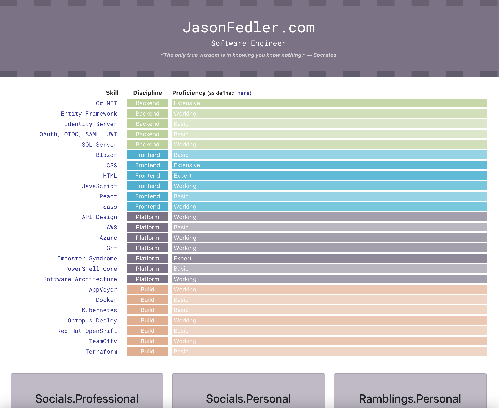
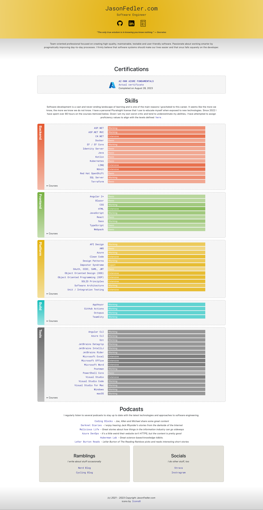
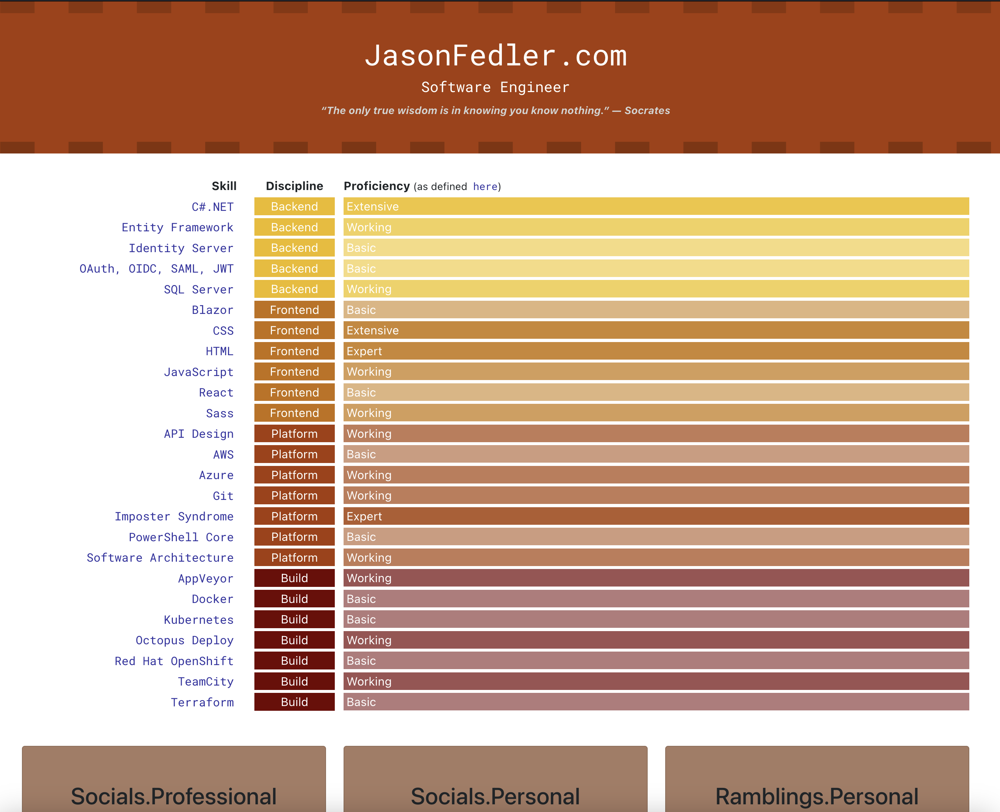
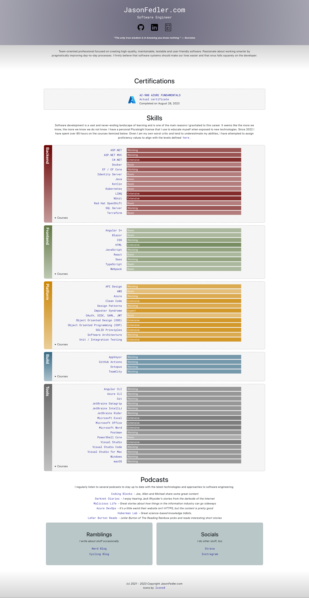

# Updating The Site

## Add discipline

To add a discipline

- add to [DisciplineType.ts](./src/enums/DisciplineType.ts)
- add to [_proficiency.scss](./scss/_proficiency.scss)
- add to [JSON Table of Contents](./src/toc.json) in the Skills array

## Update colors

Use the [Coolor.co](https://coolors.co/generate) site to get a color palette.

There are a couple color palettes for season changes or whatever. Creating a new one just means including all the variables present in one of the existing `_{season}Colors.scss` files and updating the HEX values of the colors therein. If creating a new file, be sure to update [styles.scss](./scss/styles.scss) and make sure its _before_ the `_variables` import.

### Examples of colors

#### Spring

#### Summer

#### Fall

#### Winter

