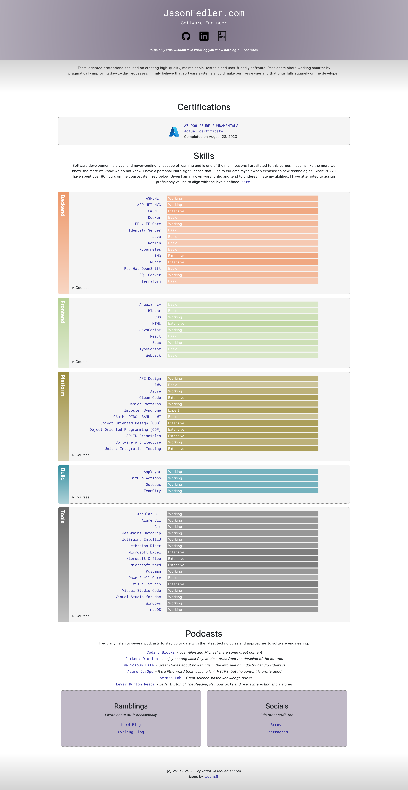
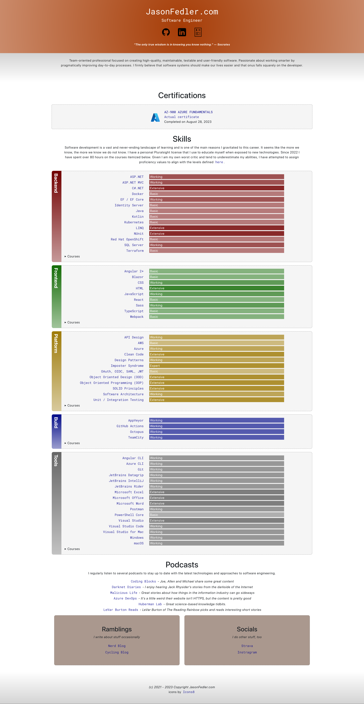

# Updating The Site

## Add discipline

To add a discipline

- add to [DisciplineType.ts](./src/enums/DisciplineType.ts)
- add to [_proficiency.scss](./scss/_proficiency.scss)
- add to [JSON Table of Contents](./src/toc.json) in the `skills` array

## Update colors

Use the [Coolor.co](https://coolors.co/generate) site to help generate a color palette.

There are a couple color palettes for season changes or whatever. Creating a new one just means including all the variables present in one of the existing `_{season}Colors.scss` files and updating the HEX values of the colors therein. If creating a new file, be sure to update [styles.scss](./scss/styles.scss) and make sure its _before_ the `_variables` import.

### Examples of colors

#### Spring

#### Summer

#### Fall

#### Winter

## Future Updates

- Add Pluralsight Courses segregated by Discipline (Backend, Frontend, etc.)
    - FE  - Styling Applications with Angular Material | ???
    - FE https://app.pluralsight.com/achievements/share/deee26f4-a683-4850-90c8-bb4628087f30 - TypeScript: The Big Picture | August 2, 2023
    - FE https://app.pluralsight.com/achievements/share/8555ae23-d1d5-4aad-8770-05b649f8ddbf - Angular 14: The Big Picture | August 1, 2023
    - BU https://app.pluralsight.com/achievements/share/b8b33ecc-aa93-49f9-b31b-b4c692e98bc9 - Docker Deep Dive | July 31, 2023
    - BU https://app.pluralsight.com/achievements/share/397df48d-b070-4a33-af41-2e3b947c6237 - Getting Started with Docker | July 7, 2023
    - BU https://app.pluralsight.com/achievements/share/b79c279d-08c6-4e81-a961-4c234f8a1a85 - Docker and Kubernetes: The Big Picture | July 6, 2023
    - BU https://app.pluralsight.com/achievements/share/e4ce9008-5c18-4a04-8a43-3a6a76663989 - Configuring Application Builds in Red Hat OpenShift Container Platform | June 22, 2023
    - BU https://app.pluralsight.com/achievements/share/b4d830ae-2179-4e79-8d52-6b451f219bad - Troubleshooting Applications in Red Hat OpenShift Container Platform | June 22, 2023
    - BU https://app.pluralsight.com/achievements/share/7dd18ad4-6507-43b3-8da8-e89aa2a276c8 - Scaling Applications in Red Hat OpenShift Container Platform | June 22, 2023
    - BU https://app.pluralsight.com/achievements/share/9fc390fa-3dc5-4698-b6cb-b8e5b5223d95 - Deploying Applications to Red Hat OpenShift Container Platform | June 22, 2023
    - PL https://app.pluralsight.com/achievements/share/7a519722-a53c-4d44-95b7-941861b743cf - Introduction to the Microsoft Security, Compliance, and Identity Fundamentals (SC-900) Exam | April 21, 2023
    - PL https://app.pluralsight.com/achievements/share/d4e5f5e3-1a8e-4ab5-9494-087fbb962291 - Microsoft Azure Security and Privacy Concepts | March 3, 2023
    - PL https://app.pluralsight.com/achievements/share/0b951054-39d8-423c-b787-4e621b0af3b5 - Microsoft Azure Services and Concepts | February 27, 2023
    - PL https://app.pluralsight.com/achievements/share/fae60eb8-14c9-4ff7-a7f4-9866dd4ff2b3 - Managing Microsoft Azure App Services | February 15, 2023
    - PL https://app.pluralsight.com/achievements/share/1da8258d-15e5-4c82-96dd-881a6e8efe9d - Microsoft Azure Security Engineer: Manage Application Access | February 1, 2023
    - PL https://app.pluralsight.com/achievements/share/a9994d53-ed07-4969-b935-bab90d980e4d - Microsoft Azure Security Engineer: Configure Secure Access Using Azure AD | January 26, 2023
    - PL https://app.pluralsight.com/achievements/share/7e4467d6-50da-4ba7-8592-7e2ccb4dc3d1 - Implementing Managed Identities for Microsoft Azure Resources | January 22, 2023
    - PL https://app.pluralsight.com/achievements/share/fe1394f4-54c3-4d7a-8869-8e2ab257d0a9 - Microsoft Azure Security Engineer: Manage Azure Active Directory Identities | January 15, 2023
    - PL https://app.pluralsight.com/achievements/share/88f09e74-8d62-4a8d-a1c2-426b460a7eb4 - Microsoft Azure Cloud Concepts | January 6, 2023
    - PL https://app.pluralsight.com/achievements/share/dd33e27e-f204-4b77-9a6f-b2345f98f210 - Microsoft Azure Fundamentals: Introduction to the AZ-900 Exam | January 5, 2023
    - PL https://app.pluralsight.com/achievements/share/dcd7b911-1027-4046-9369-61e28ad0a8d1 - Learning the PowerShell Language | December 31, 2022
    - PL https://app.pluralsight.com/achievements/share/120e2b02-7951-412b-867c-db055b942aa3 - Installing and Running PowerShell | December 13, 2022
    - BE https://app.pluralsight.com/achievements/share/bed9d9bb-dcb7-41f7-93ae-d8845a18a40c - C# Design Patterns: Bridge | December 10, 2022
    - BE https://app.pluralsight.com/achievements/share/7ad26831-ba8c-4c88-9efc-42c38b28505a - Specification Pattern in C# | December 10, 2022
    - BE https://app.pluralsight.com/achievements/share/7519b3a1-c0fa-4c52-983a-89c6e48ba643 - Applying Functional Principles in C# 6 | December 6, 2022
    - BE https://app.pluralsight.com/achievements/share/c40f26f0-11d4-4d44-a0a9-f290f7d1cfe4 - Functional Programming with C# | December 1, 2022
